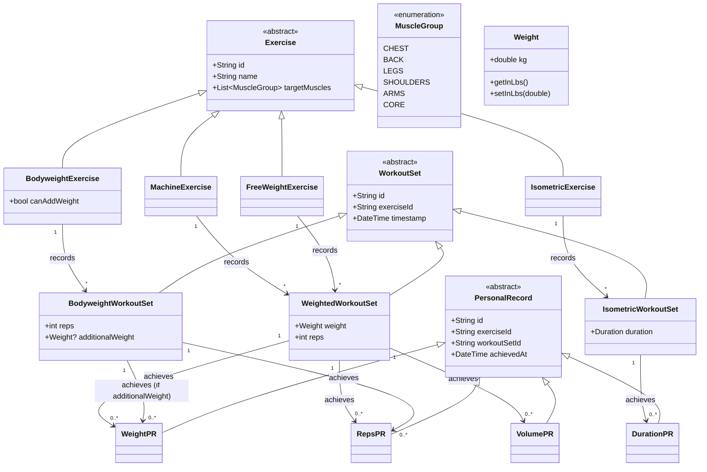

# Domain Model Design

## Class Hierarchy and Relationships

## Key Relationships

**Exercise → WorkoutSet (strict typing):**
- BodyweightExercise → BodyweightWorkoutSet (tracks reps + optional additionalWeight)
- FreeWeightExercise → WeightedWorkoutSet (tracks weight + reps)
- MachineExercise → WeightedWorkoutSet (tracks weight + reps)
- IsometricExercise → IsometricWorkoutSet (tracks duration)

**WorkoutSet → PersonalRecord (by metrics):**
- BodyweightWorkoutSet → RepsPR, WeightPR (if additionalWeight used)
- WeightedWorkoutSet → WeightPR, RepsPR, VolumePR
- IsometricWorkoutSet → DurationPR

## Design Principles

- **Type Safety**: Each concept has a concrete type (no flexible Map<String, dynamic>)
- **Consistency**: All three main hierarchies follow the same inheritance pattern
- **Separation of Concerns**: 
  - Exercise = Definition/Template (what the exercise is)
  - WorkoutSet = Instance/Recording (what you actually did)
  - PersonalRecord = Achievement (your best performance)
