# Domain Model Design

## Class Hierarchy and Relationships

```mermaid
classDiagram
    %% Exercise Definitions (Templates)
    class Exercise {
        <<abstract>>
        +String id
        +String name
        +String description
        +bool isCustom
        +EquipmentType equipmentType
        +roundToNearest(weight, isMetric) double
    }
    
    class StrengthExercise {
        <<abstract>>
        +List~MuscleGroup~ targetMuscles
    }
    
    class CardioExercise {
        <<abstract>>
    }
    
    class BodyweightExercise {
        +bool canAddWeight
    }
    
    class FreeWeightExercise {
    }
    
    class MachineExercise {
    }
    
    class AssistedMachineExercise {
    }
    
    class IsometricExercise {
        +bool isBodyweightBased
    }
    
    class DistanceCardioExercise {
    }
    
    class DurationCardioExercise {
    }
    
    Exercise <|-- StrengthExercise
    Exercise <|-- CardioExercise
    
    StrengthExercise <|-- BodyweightExercise
    StrengthExercise <|-- FreeWeightExercise
    StrengthExercise <|-- MachineExercise
    StrengthExercise <|-- AssistedMachineExercise
    StrengthExercise <|-- IsometricExercise
    
    CardioExercise <|-- DistanceCardioExercise
    CardioExercise <|-- DurationCardioExercise

    %% Workout Set Recordings (Instances)
    class WorkoutSet {
        <<abstract>>
        +String id
        +String exerciseId
        +DateTime timestamp
        +getVolume()* double?
    }
    
    class BodyweightWorkoutSet {
        +int reps
        +Weight? additionalWeight
        +getVolume() null
    }
    
    class WeightedWorkoutSet {
        +Weight weight
        +int reps
        +getVolume() weight.kg * reps
    }
    
    class AssistedMachineWorkoutSet {
        +Weight assistanceWeight
        +int reps
        +getEffectiveWeight(userBodyweight) userBodyweight.kg - assistanceWeight.kg
        +getVolume() null
    }
    
    class IsometricWorkoutSet {
        +Duration? duration
        +Weight? weight
        +getVolume() null
    }
    
    class DistanceCardioWorkoutSet {
        +Duration duration
        +Distance distance
        +getPace() distance / duration
        +getVolume() null
    }
    
    class DurationCardioWorkoutSet {
        +Duration duration
        +getVolume() null
    }
    
    WorkoutSet <|-- BodyweightWorkoutSet
    WorkoutSet <|-- WeightedWorkoutSet
    WorkoutSet <|-- AssistedMachineWorkoutSet
    WorkoutSet <|-- IsometricWorkoutSet
    WorkoutSet <|-- DistanceCardioWorkoutSet
    WorkoutSet <|-- DurationCardioWorkoutSet

    %% Personal Records (Achievements)
    class PersonalRecord {
        <<abstract>>
        +String id
        +String exerciseId
        +String workoutSetId
        +DateTime achievedAt
    }
    
    class WeightPR {
    }
    
    class RepsPR {
    }
    
    class VolumePR {
    }
    
    class DurationPR {
    }
    
    class DistancePR {
    }
    
    class PacePR {
    }
    
    PersonalRecord <|-- WeightPR
    PersonalRecord <|-- RepsPR
    PersonalRecord <|-- VolumePR
    PersonalRecord <|-- DurationPR
    PersonalRecord <|-- DistancePR
    PersonalRecord <|-- PacePR

    %% Relationships - Explicit mappings
    BodyweightExercise "1" --> "*" BodyweightWorkoutSet : records
    FreeWeightExercise "1" --> "*" WeightedWorkoutSet : records
    MachineExercise "1" --> "*" WeightedWorkoutSet : records
    AssistedMachineExercise "1" --> "*" AssistedMachineWorkoutSet : records
    IsometricExercise "1" --> "*" IsometricWorkoutSet : records
    DistanceCardioExercise "1" --> "*" DistanceCardioWorkoutSet : records
    DurationCardioExercise "1" --> "*" DurationCardioWorkoutSet : records
    
    BodyweightWorkoutSet "1" --> "0..*" RepsPR : achieves
    BodyweightWorkoutSet "1" --> "0..*" WeightPR : achieves (if additionalWeight)
    WeightedWorkoutSet "1" --> "0..*" WeightPR : achieves
    WeightedWorkoutSet "1" --> "0..*" RepsPR : achieves
    WeightedWorkoutSet "1" --> "0..*" VolumePR : achieves
    IsometricWorkoutSet "1" --> "0..*" DurationPR : achieves
    DistanceCardioWorkoutSet "1" --> "0..*" DurationPR : achieves
    AssistedMachineWorkoutSet "1" --> "0..*" WeightPR : achieves (lowest assistance)
    AssistedMachineWorkoutSet "1" --> "0..*" RepsPR : achieves
    DistanceCardioWorkoutSet "1" --> "0..*" DistancePR : achieves
    DistanceCardioWorkoutSet "1" --> "0..*" PacePR : achieves
    DurationCardioWorkoutSet "1" --> "0..*" DurationPR : achieves

    %% Supporting Types
    class EquipmentType {
        <<enumeration>>
        DUMBBELL
        PLATE
        KETTLEBELL
        MACHINE
        CABLE
        OTHER
    }
    
    class MuscleGroup {
        <<enumeration>>
        CHEST
        BACK
        LEGS
        SHOULDERS
        ARMS
        CORE
    }
    
    class Weight {
        +double kg
        +getInLbs()
        +setInLbs(double)
    }
    
    class Distance {
        +double meters
        +getInMiles()
        +setInKm(double)
    }
```

## Key Relationships

**Exercise → WorkoutSet (strict typing):**

*Strength Training:*
- BodyweightExercise → BodyweightWorkoutSet (tracks reps + optional additionalWeight)
- MachineExercise → WeightedWorkoutSet (tracks weight + reps)
- AssistedMachineExercise → AssistedMachineWorkoutSet (tracks assistance weight + reps, inverted progres best), RepsPR
- MachineExercise → WeightedWorkoutSet (tracks weight + reps)
- IsometricExercise → IsometricWorkoutSet (tracks optional duration + optional weight)

*Cardio:*
- DistanceCardioExercise → DistanceCardioWorkoutSet (tracks duration + distance, calculates pace)
- DurationCardioExercise → DurationCardioWorkoutSet (tracks duration only)

**WorkoutSet → PersonalRecord (by metrics):**

*Strength Training:*
- BodyweightWorkoutSet → RepsPR, WeightPR (if additionalWeight used)
- WeightedWorkoutSet → WeightPR, RepsPR, VolumePR
- IsometricWorkoutSet → DurationPR

*Cardio:*
- DistanceCardioWorkoutSet → DurationPR (for specific distance), DistancePR (longest distance), PacePR (best average pace)
- DurationCardioWorkoutSet → DurationPR (longest duration)

## Design Principles - Strength Training

### Core Architecture
- **Type Safety**: Each concept has a concrete type (no flexible Map<String, dynamic>)
- **Strict Mappings**: Each Exercise type maps to exactly one WorkoutSet type
- **Separation of Concerns**: 
  - Exercise = Definition/Template (what the exercise is)
  - Traditional resistance machines where more weight = harder
  PersonalRecord = Achievement (your best performance)

### Exercise Classification
- **BodyweightExercise**: Pure bodyweight movements (push-ups, pull-ups, dips)
  - Can optionally add weight (weighted pull-ups, weighted dips)
  - Separated from weighted exercises for semantic clarity and filtering
  
- **FreeWeightExercise**: Barbells, dumbbells, kettlebells
  - Free-path movements requiring stabilization
  
- **MachineExercise**: Fixed-path equipment (smith machine, leg press, cables, resistance bands)
  - Guided movements, includes resistance bands

- **AssistedMachineWorkoutSet**: No volume calculation
  - `assistanceWeight` represents counterbalance force reducing effective load
  - **Inverted comparison logic**: Lower assistance weight = better performance
  - `getEffectiveWeight(userBodyweight)` calculates actual resistance (optional, requires user weight)
  - PRs compare assistance weight in reverse (minimum assistance = maximum PR)
  - Example progression: 60kg assist → 50kg assist → 40kg assist (each is a PR)
  
  - Traditional resistance machines where more weight = harder
  
- **AssistedMachineExercise**: Counterbalance machines that reduce effective bodyweight (assisted pull-ups, assisted dips)
  - Weight represents assistance provided by the machine
  - **Inverted progress metric**: Lower assistance weight = better (getting stronger)
  - Effective resistance = bodyweight - assistance weight
  - Example: 80kg person using 30kg assistance = effectively lifting 50kg
  - Progress: 40kg assist → 30kg assist → 20kg assist → unassisted
      - Weight represents total load being held
  - Duration tracking for hold time (optional - user may not track time)
  - Optional weight for weighted holds (weight belt, vest, plates, dumbbells)
  - Examples: bodyweight dead hang (duration only), weighted plank (duration + weight), casual logging (neither tracked)

### Volume Calculation
- **WeightedWorkoutSet**: `volume = weight.kg × reps`
  - Assisted Machine: WeightPR (lowest assistance), RepsPR
    - **WeightPR logic is inverted**: Tracks the minimum assistance weight used (best = least help)
    - Display: "PR: 20kg assistance" means you needed only 20kg help (better than 30kg assistance)
    - Can track RepsPR at specific assistance levels independently
  - Standard volume metric for strength training
  
- **BodyweightWorkoutSet**: No volume calculation
  - IsometricWorkoutSet**: No volume (duration-based metric)
  - Both duration and weight are optional (flexible logging)
  - Allows tracking: time only, weight only, both, or neither
  - No traditional volume calculation (time under tension is different metric)

### Personal Records
- **Reference-only approach**: PR classes only store `workoutSetId`, not cached values
  - Always retrieve actual values from the referenced WorkoutSet
  - Ensures data consistency without update logic
  - Slightly slower queries, but simpler architecture
  
- **PR types per exercise category**:
  - Bodyweight: RepsPR, WeightPR (when additionalWeight used)
  - Free Weight & Machine: WeightPR, RepsPR, VolumePR
  - Isometric: DurationPR (only when duration tracked; weight is informative but doesn't create separate PR)

## Design Principles - Cardio

### Core Architecture
- **Same foundational principles as strength training**: Type safety, strict mappings, separation of concerns
- **Classification by metrics tracked**: DistanceCardio vs DurationCardio based on whether distance is meaningful

### Exercise Classification
- **DistanceCardioExercise**: Activities where distance tracking is meaningful (running, cycling, rowing, swimming)
  - Records both duration and distance
  - Assisted Machine: WeightPR (lowest assistance), RepsPR
    - **WeightPR logic is inverted**: Tracks the minimum assistance weight used (best = least help)
    - Display: "PR: 20kg assistance" means you needed only 20kg help (better than 30kg assistance)
    - Can track RepsPR at specific assistance levels independently
  - Pace calculated at runtime from these values
  - Suitable for machines/activities with distance measurement
  
- **DurationCardioExercise**: Activities where only duration matters (elliptical, stair climber, battle ropes)
  - Duration-only tracking for equipment without meaningful distance metrics
  - Simpler data structure for non-distance-based conditioning

### Activity Intensity Variations
- **Separate exercises for intensity levels**: Walking vs Running are distinct exercises
  - Each has its own PR tracking (fastest 5K run, longest walk)
  - User creates exercise names that reflect their use case
  - Classification is by data structure needed, not by heart rate/intensity

### Personal Records
- **DistanceCardio PRs**:
  - DurationPR: Fastest time for specific distance (e.g., fastest 5K)
  - DistancePR: Longest distance achieved (useful for endurance tracking)
  - PacePR: Best average pace across any session
  
- **DurationCardio PRs**:
  - DurationPR: Longest session duration

### Explicit Design Decisions (What we DON'T have)
- ❌ No heart rate tracking - out of scope for weightlifter-focused app
- ❌ No interval detail tracking - HIIT/interval training recorded as one combined session
  - 10x(400m sprint + 200m jog) = one 6km, 30min session
  - Prioritizes simplicity over granular interval analysis
- ❌ No split times - no lap tracking or kilometer splits
- ❌ No elevation/incline tracking - flat assumption
- ❌ No activity-specific enums - use exercise name to distinguish running from cycling

### Pace Calculation
- **Distance.meters / Duration.seconds** = meters per second (stored format)
- Display conversions: min/km, min/mile, km/h, mph calculated at runtime
- Pace is derived metric, not stored directly

### Explicit Design Decisions (What we DON'T have)
- ❌ No `workoutId` grouping - derive sessions from timestamp at runtime
- ❌ No `notes` field on WorkoutSet - keep data structure minimal
- ❌ No bodyweight volume tracking - requires user weight history (complexity not justified)
- ❌ No loaded carries yet - different enough to warrant separate class if needed later

### Equipment Type System
- **Exercise.equipmentType**: Each exercise declares its equipment (dumbbell, barbell, machine, etc.)
  - Enables smart weight rounding based on available gym equipment
  - Exercise identity tied to equipment: "Barbell Bench Press" ≠ "Dumbbell Bench Press"
  - Stored in exercise JSON data, loaded at app startup

**EquipmentType Enum:**
- `dumbbell`: Fixed-increment gym dumbbells (0.5kg-80kg, 1lb-150lb)
- `plate`: Olympic plate loading system (5kg-200kg, 45lb-455lb, 2.5kg/5lb increments)
  - Used by: barbells, EZ bars, weighted dips, weighted pull-ups, any plate-loadable exercise
  - Represents the loading mechanism, not the specific bar type
- `kettlebell`: Competition/gym standard (4kg-48kg, 10lb-100lb)
- `machine`: Weight stack machines (5kg/10lb modulo rounding)
- `cable`: Cable systems (5kg/10lb modulo rounding)
- `other`: Custom/flexible equipment (rounds to 1 decimal place)

**Rounding Behavior:**
- **Array-based** (dumbbell/plate/kettlebell): Rounds to nearest available gym weight
  - Example: 22.7kg dumbbell → 22.5kg (closest in array)
  - Example: 101.8kg plate-loaded → 100kg (2.5kg plate increment)
  - Prevents suggesting non-existent weights like "23.3kg dumbbell" or "103.7kg barbell"
- **Modulo-based** (machine/cable): Conservative 5kg/10lb increments
  - Example: 114.3kg machine → 115kg (5kg increment)
  - Works with all brands (10lb, 20lb, 5kg, 10kg stacks)
- **Decimal precision** (other): Rounds to 0.1 precision
  - Example: 45.67kg → 45.7kg
  - For custom equipment, resistance bands, or flexible logging

**Exercise.roundToNearest(weight, isMetric):**
- Convenience method delegates to `EquipmentType.roundToNearest()`
- Used in UI layer for manual input validation
- Used in CalculatePRPercentagesUseCase for PR percentage buttons

**Equipment Selection for Bodyweight Exercises:**
- When bodyweight exercises allow added weight (weighted pull-ups), equipment type indicates what user typically adds:
  - `plate`: Using plates on dip belt or weight belt (most common)
  - `dumbbell`: Using dumbbell between legs or dip belt with dumbbells
  - `other`: Using weight vest or mixed equipment
- This affects rounding for `additionalWeight` field on BodyweightWorkoutSet

### Smart PR Percentage Calculations
**CalculatePRPercentagesUseCase**: Business logic for input panel PR buttons
- Fetches user's WeightPR for exercise
- Retrieves actual weight value from referenced WorkoutSet
- Calculates 100%, 90%, 80%, 50% of PR weight
- Rounds each percentage using `exercise.roundToNearest()`
- Returns `PRPercentages` value object or null if no PR exists

**Example Flow:**
1. User opens "Barbell Bench Press" (equipmentType = plate)
2. Use case finds PR: 100kg
3. Calculates: 100%, 90kg, 80kg, 50kg
4. Rounds: 100kg → 100kg, 90kg → 90kg, 80kg → 80kg, 50kg → 50kg ✓
5. UI displays buttons with exact achievable weights

**Equipment-Aware Rounding Benefits:**
- User never sees "22.5kg dumbbell" if gym only has 20kg and 25kg
- Machine users get clean 5kg increments (no 113.7kg suggestions)
- PR percentages always suggest realistic, loadable weights

### Searchability & Customization
- **Exercise.description**: Enables search beyond just name matching
- **Exercise.isCustom**: Distinguishes user-created from pre-loaded exercises
- **Exercise.targetMuscles**: Array to support compound movements (squat targets legs, core, glutes)
- **Exercise.equipmentType**: Required field for all exercises (default to `other` if unknown)
