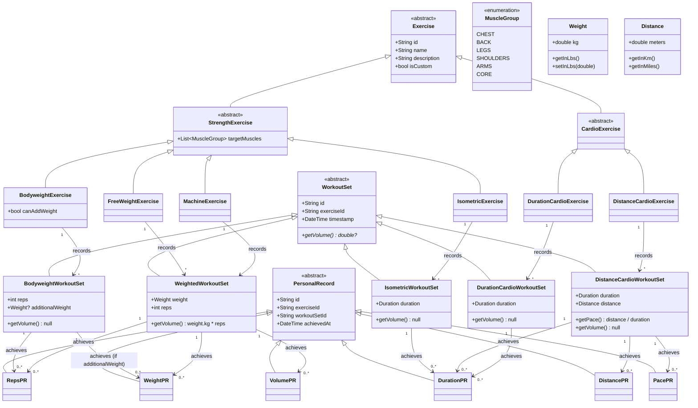

# Domain Model Design

## Class Hierarchy and Relationships

## Key Relationships

**Exercise → WorkoutSet (strict typing):**
- BodyweightExercise → BodyweightWorkoutSet (tracks reps + optional additionalWeight)
- FreeWeightExercise → WeightedWorkoutSet (tracks weight + reps)
- MachineExercise → WeightedWorkoutSet (tracks weight + reps)
- IsometricExercise → IsometricWorkoutSet (tracks duration)

**WorkoutSet → PersonalRecord (by metrics):**
- BodyweightWorkoutSet → RepsPR, WeightPR (if additionalWeight used)
- WeightedWorkoutSet → WeightPR, RepsPR, VolumePR
- IsometricWorkoutSet → DurationPR

## Design Principles - Strength Training

### Core Architecture
- **Type Safety**: Each concept has a concrete type (no flexible Map<String, dynamic>)
- **Strict Mappings**: Each Exercise type maps to exactly one WorkoutSet type
- **Separation of Concerns**: 
  - Exercise = Definition/Template (what the exercise is)
  - WorkoutSet = Instance/Recording (what you actually did)
  - PersonalRecord = Achievement (your best performance)

### Exercise Classification
- **BodyweightExercise**: Pure bodyweight movements (push-ups, pull-ups, dips)
  - Can optionally add weight (weighted pull-ups, weighted dips)
  - Separated from weighted exercises for semantic clarity and filtering
  
- **FreeWeightExercise**: Barbells, dumbbells, kettlebells
  - Free-path movements requiring stabilization
  
- **MachineExercise**: Fixed-path equipment (smith machine, leg press, cables, resistance bands)
  - Guided movements, includes resistance bands
  
- **IsometricExercise**: Static holds tracking duration only (planks, wall sits, dead hangs)
  - No weight tracking (loaded carries excluded - different movement pattern)

### Volume Calculation
- **WeightedWorkoutSet**: `volume = weight.kg × reps`
  - Standard volume metric for strength training
  
- **BodyweightWorkoutSet**: No volume calculation
  - Decision: Don't calculate bodyweight-only volume (would require user bodyweight history)
  - Only track RepsPR for bodyweight-only
  - Track WeightPR when additionalWeight is used
  
- **IsometricWorkoutSet**: No volume (duration-based metric)

### Personal Records
- **Reference-only approach**: PR classes only store `workoutSetId`, not cached values
  - Always retrieve actual values from the referenced WorkoutSet
  - Ensures data consistency without update logic
  - Slightly slower queries, but simpler architecture
  
- **PR types per exercise category**:
  - Bodyweight: RepsPR, WeightPR (when additionalWeight used)
  - Free Weight & Machine: WeightPR, RepsPR, VolumePR
  - Isometric: DurationPR

### Explicit Design Decisions (What we DON'T have)
- ❌ No `workoutId` grouping - derive sessions from timestamp at runtime
- ❌ No `notes` field on WorkoutSet - keep data structure minimal
- ❌ No equipment attributes on Exercise - semantic type is enough for filtering
- ❌ No bodyweight volume tracking - requires user weight history (complexity not justified)
- ❌ No loaded carries yet - different enough to warrant separate class if needed later

### Searchability & Customization
- **Exercise.description**: Enables search beyond just name matching
- **Exercise.isCustom**: Distinguishes user-created from pre-loaded exercises
- **Exercise.targetMuscles**: Array to support compound movements (squat targets legs, core, glutes)
